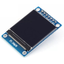
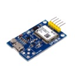
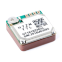
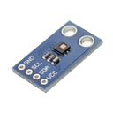
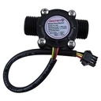
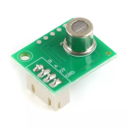

## rpi-devices 
[](https://github.com/shanghuiyang/rpi-devices/actions/workflows/ci.yml)
[](https://github.com/shanghuiyang/rpi-devices/blob/master/LICENSE)
[](https://godoc.org/github.com/shanghuiyang/rpi-devices)

rpi-devices implements drivers for various kinds of sensors or devices based on [raspberry pi](https://www.raspberrypi.org/) in pure Golang.

### Usage
```go
package main

import (
	"time"

	"github.com/shanghuiyang/rpi-devices/dev"
)

const pin = 26

func main() {
	led := dev.NewLedImp(pin)
	for {
		led.On()
		time.Sleep(1 * time.Second)
		led.Off()
		time.Sleep(1 * time.Second)
	}
}
```

### Currently Implemented Drivers

|Sensors|Image|Description|Example|Projects|
|-------|-----|-----|-------|---|
|ADS1015||Analog-to-digital converter|N/A|[joystick](https://github.com/shanghuiyang/rpi-projects/tree/main/projects/joystick)|
|Button||Button module|[example](/example/button/main.go)|[vedio-monitor](https://github.com/shanghuiyang/rpi-projects/tree/main/projects/vmonitor)|
|Buzzer||Buzzer module|N/A|[car](https://github.com/shanghuiyang/rpi-projects/tree/main/projects/car), [door-dog](https://github.com/shanghuiyang/rpi-projects/tree/main/projects/doordog)|
|BYJ2848||Step motor|[example](/example/byj2848/main.go)|N/A|
|Collision Switch||A switch for deteching collision|[example](/example/collision_switch/main.go)|[car](https://github.com/shanghuiyang/rpi-projects/tree/main/projects/car)|
|DHT11||Temperature & Humidity sensor|[example](/example/dht11/main.go)|[home-asst](https://github.com/shanghuiyang/rpi-projects/tree/main/projects/homeasst)|
|Display Digital Led TM1637 ||Digital led module|[example](/example/display_led_tm1637/main.go)|[auto-air](https://github.com/shanghuiyang/rpi-projects/tree/main/projects/autoair)|
|Display LCD||LCD display module|[example](/example/display_lcd/main.go)|[home-asst](https://github.com/shanghuiyang/rpi-projects/tree/main/projects/homeasst)
|Display SSD1360||Oled display module|[example](/example/display_oled_ssd1306/main.go)|[home-asst](https://github.com/shanghuiyang/rpi-projects/tree/main/projects/homeasst)|
|Display ST7899||TFT LCD display module|[example](/example/display_oled_ssd1306/main.go)|[gps-tracker](https://github.com/shanghuiyang/rpi-projects/tree/main/projects/gpstracker)|
|DS18B20||Temperature sensor|[example](/example/temperature/main.go)|[auto-fan](https://github.com/shanghuiyang/rpi-projects/tree/main/projects/autofan)|
|Encoder||Encoder sensor|[example](/example/encoder/main.go)|N/A|
|GPS NEO-6M||Location sensor|[example](/example/gps/main.go)|[car](https://github.com/shanghuiyang/rpi-projects/tree/main/projects/car)|
|GPS HT1818||Location sensor|N/A|[gps-tracker](https://github.com/shanghuiyang/rpi-projects/tree/main/projects/gpstracker)|
|GY-25||Angle sensor|[example](/example/gy25/main.go)|[car](https://github.com/shanghuiyang/rpi-projects/tree/main/projects/car)|
|HC-SR04||Ultrasonic distance meter|[example](/example/hcsr04/main.go)|[auto-light](https://github.com/shanghuiyang/rpi-projects/tree/main/projects/autolight), [doordog](https://github.com/shanghuiyang/rpi-projects/tree/main/projects/doordog)|
|HDC1080||Thermohygrometer sensor|[example](/example/hdc1080/main.go)|[home-asst](https://github.com/shanghuiyang/rpi-projects/tree/main/projects/homeasst)|
|Humidity Detector||Soil humidity detector|[example](/example/humidity_detector/main.go)|N/A|
|Infrared Encoder/Decoder||Infrared encoder/decoder|[example](/example/ir_coder/main.go)|N/A|
|Infrared||Infrared sensor|[example](/example/ir_detector/main.go)|N/A|
|Joystick||XY Dual Axis Joystick|[example](/example/joystick/main.go)|[car](https://github.com/shanghuiyang/rpi-projects/tree/main/projects/car)|
|L298N||Motor driver|N/A|[car](https://github.com/shanghuiyang/rpi-projects/tree/main/projects/car)|
|LC12S||2.4g wireless module|[example](/example/lc12s/main.go)|[car](https://github.com/shanghuiyang/rpi-projects/tree/main/projects/car)|
|Led||Led light|[example](/example/led/main.go)|[car](https://github.com/shanghuiyang/rpi-projects/tree/main/projects/car), [vedio-monitor](https://github.com/shanghuiyang/rpi-projects/tree/main/projects/vmonitor)|
|MPU6050||6-axis motion sensor|[example](/example/mpu6050/main.go)|N/A|
|PCF8591||Analog-to-digital converter|N/A|N/A|
|PMS7003||Air quality sensor|[example](/example/air/main.go)|[auto-air](https://github.com/shanghuiyang/rpi-projects/tree/main/projects/autoair)|
|Relay||Relay module|[example](/example/relay/main.go)|[auto-fan](https://github.com/shanghuiyang/rpi-projects/tree/main/projects/autofan)|
|RX480E-4||433MHz Wireless RF Receiver|[example](/example/rx480e4/main.go)|[remote-light](https://github.com/shanghuiyang/rpi-projects/tree/main/projects/rlight)|
|SG90||Servo motor|[example](/example/sg90/main.go)|[auto-air](https://github.com/shanghuiyang/rpi-projects/tree/main/projects/autoair), [car](https://github.com/shanghuiyang/rpi-projects/tree/main/projects/car), [vedio-monitor](https://github.com/shanghuiyang/rpi-projects/tree/main/projects/vmonitor)|
|SW-420||Shaking sensor|[example](/example/sw420/main.go)|[auto-air-out](https://github.com/shanghuiyang/rpi-projects/tree/main/projects/autoairout)|
|US-100||Ultrasonic distance meter|[example](/example/us100/main.go)|[car](https://github.com/shanghuiyang/rpi-projects/tree/main/projects/car)|
|Voice Detector||Voice detector|N/A|N/A|
|Water Flow Sensor||Water flow sensor|[example](/example/water_flow_sensor/main.go)|N/A|
|ZE08-CH2O||CH2O sensor|[example](/example/ze08ch2o/main.go)|[ch2o-monitor](https://github.com/shanghuiyang/rpi-projects/tree/main/projects/ch2omonitor)|
|ZP16||Gas detector|[example](/example/zp16/main.go)|[home-asst](https://github.com/shanghuiyang/rpi-projects/tree/main/projects/homeasst)|

### Projects
See my another repo [rpi-projects](https://github.com/shanghuiyang/rpi-projects) for all projects that I developed them using this libaray.
