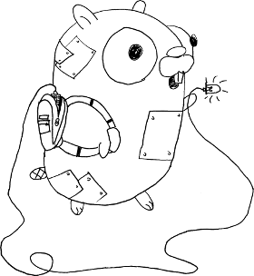
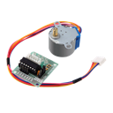
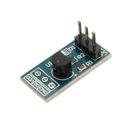
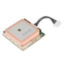

# rpi-devices 
[](https://travis-ci.org/shanghuiyang/rpi-devices)

rpi-devices let you drive the devices using a raspberry pi in golang, and push you data onto an iot cloud platform for visualizing.

The following devices had been implemented in current version, and a device interface was designed to let you add new devices easily.


              

         LED           Relay        Step-Motor     Temperature        GPS

## Data Visualize
The data from devices can be pushed to an iot cloud platform for visualizing. rpi-devices designed an interface of iot cloud, and implemented the interface for [WSN](http://www.wsncloud.com/) cloud and [OneNET](https://open.iot.10086.cn/) cloud. You can implement the interface for new iot cloud and add it to the framwork easily.

* [WSN](http://www.wsncloud.com/)
    
    visualize the temperature
	
	
* [OneNET](https://open.iot.10086.cn/)

    visualize the gps locaitons

	

## Usage

It is very easy for cross-compiling and deploy for golang. It is an example that compiles the binary for raspberry pi on MacOS.
```shell
$ CGO_ENABLED=0 GOOS=linux GOARCH=arm GOARM=6 go build -o devices.pi main.go
````

If you aren't sure the cpu info of your raspberry pi, check it out by,
```shell
$ lscup
# those are the cpu info of my raspberry pi 2.
# ------------------------------------------------------------
# Architecture:        armv6l
# Byte Order:          Little Endian
# CPU(s):              1
# On-line CPU(s) list: 0
# Thread(s) per core:  1
# Core(s) per socket:  1
# Socket(s):           1
# Vendor ID:           ARM
# Model:               7
# Model name:          ARM1176
# Stepping:            r0p7
# CPU max MHz:         700.0000
# CPU min MHz:         700.0000
# BogoMIPS:            697.95
# Flags:               half thumb fastmult vfp edsp java tls
# ------------------------------------------------------------
```

And then, deploy the binary to your raspberry pi by,
```shell
$ scp devices.pi pi@192.168.31.57:/home/pi
```
`192.168.31.57` is the ip address of my raspberry pi, you need to replace it with the ip of your raspberry pi.

ssh to you raspberry pi, and run the binary.
```shell
$ ssh pi@192.168.31.57
$ ./devices.pi

# or, run it in background
$ nohub ./devices.pi > devices.pi 2>&1 &
```

## Examples

### LED
```go
package main

import (
	"fmt"
	"log"

	"github.com/shanghuiyang/rpi-devices/devices"
)

const (
	p26 = 26
)

func main() {
	led := devices.NewLed(p26)
	go led.Start()

	var op string
	for {
		fmt.Printf(">>op: ")
		if n, err := fmt.Scanf("%s", &op); n != 1 || err != nil {
			log.Printf("invalid operator, error: %v", err)
			continue
		}
		switch op {
		case "on":
			devices.ChLedOp <- devices.On
		case "off":
			devices.ChLedOp <- devices.Off
		case "blink":
			devices.ChLedOp <- devices.Blink
		case "q":
			log.Printf("done\n")
			return
		default:
			fmt.Printf("invalid operator, should be: on, off, blink or q\n")
		}
	}
}
```

### Relay
```go
package main

import (
	"fmt"
	"log"

	"github.com/shanghuiyang/rpi-devices/devices"
)

const (
	p7 = 7
)

func main() {
	r := devices.NewRelay(p7)
	go r.Start()

	var op string
	for {
		fmt.Printf(">>op: ")
		if n, err := fmt.Scanf("%s", &op); n != 1 || err != nil {
			log.Printf("invalid operator, error: %v", err)
			continue
		}
		switch op {
		case "on":
			devices.ChRelayOp <- devices.On
		case "off":
			devices.ChRelayOp <- devices.Off
		case "q":
			log.Printf("done\n")
			return
		default:
			fmt.Printf("invalid operator, should be: on, off or q\n")
		}
	}
}
```

### Step-Motor
```go
package main

import (
	"fmt"
	"log"

	"github.com/shanghuiyang/rpi-devices/devices"
)

const (
	p8  = 8  // in1 for step motor
	p25 = 25 // in2 for step motor
	p24 = 24 // in3 for step motor
	p23 = 23 // in4 for step motor
)

func main() {
	m := devices.NewStepMotor(p8, p25, p24, p23)
	go m.Start()
	log.Printf("step motor is ready for service\n")

	var input int
	for {
		fmt.Printf(">>op: ")
		if n, err := fmt.Scanf("%d", &input); n != 1 || err != nil {
			log.Printf("invalid operator, error: %v", err)
			continue
		}
		if input == 0 {
			break
		}
		op := devices.Operator(input)
		devices.ChStepMotorOp <- op
	}
	log.Printf("step motor stop service\n")
}
```

### GPS
```go
package main

import (
	"log"

	s "github.com/shanghuiyang/rpi-devices/devices"
)

func main() {
	g := s.NewGPS()
	pt, err := g.Loc()
	if err != nil {
		log.Printf("failed, error: %v", err)
		return
	}
	log.Printf("%v", pt)
	g.Close()
}
```

### Temperature
```go
package main

import (
	"fmt"

	"github.com/shanghuiyang/rpi-devices/devices"
)

func main() {
	t := devices.NewTemperature()
	c, err := t.GetTemperature()
	if err != nil {
		fmt.Printf("failed to get temperature, error: %v", err)
		return
	}
	fmt.Printf("current temperature: %v", c)
}
```
