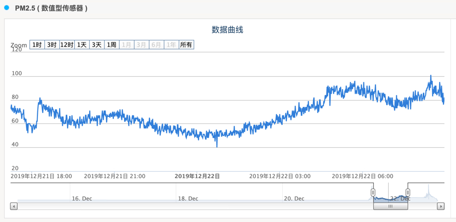

# Auto Air
Auto-Air works together with a PMS7003 module, a sensor for detecting pm2.5 and pm10. The air-cleaner, [honeywell PAC1101](https://www.amazon.in/Honeywell-Touch-HAC35M1101G-Purifier-Champagne/dp/B016BDYMVC) with a touchable control panel, will be turned on automatically when the pm2.5 >= 120 ug/m3, and turned off automatically when the pm2.5 < 100 ug/m3. You also can use your mobile phone to remotely turn the air-cleaner on or off.

hardware:
- raspberry A+
- PMS7003, an air quality sensor
- sevo SG90
- led digital module which is used to display the pm2.5 value

iot cloud is used for displaying historic pm2.5 values

