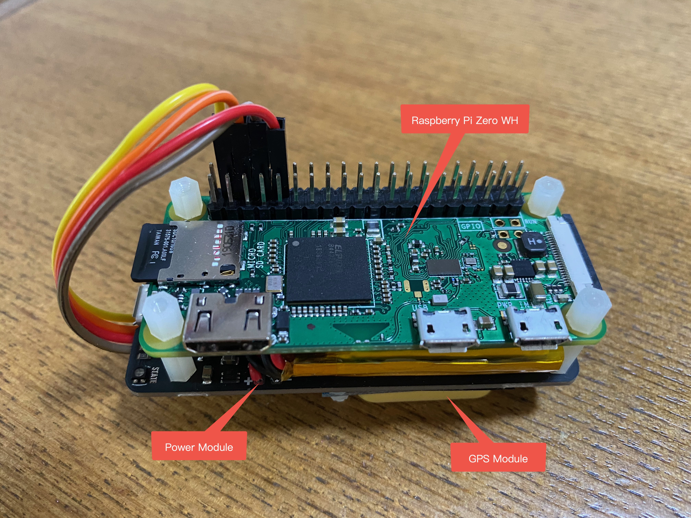
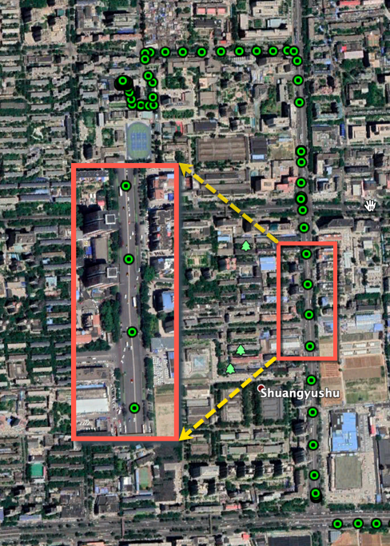

# GPS Tracker
GPS-Tracker works together with a GSP module and a power module.

hardware:
- raspberry pi zero wh
- gps module
- power module

iot cloud is used for displaying location on a map in every 3 seconds.

you also can download the track from raspberry pi and then show them on google earth.

