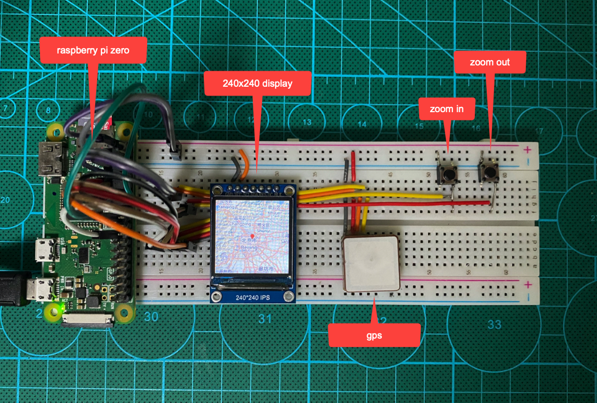

# GPS Tracker
GPS-Tracker displays current location on street/satellite map using a 240x240 display mudule.

**Hardwares:**
- Raspberry Pi Zero WH
- GPS Module
- TFT 240x240 Display
- Buttons

you also can download the track(csv file) from raspberry pi and then show them on google earth.

