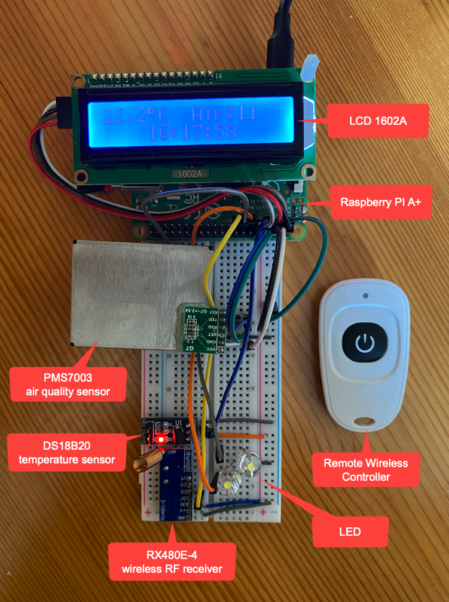

# homeasst
homeasst detects temperature and air quality(PM 2.5) and dispalys them on a LCD 1602A display. There is a LED light which is controlled by a remote wireless controller in a distance less then 5 meters, and anothor LED light is controlled by phone from anywhere.

hardware:
- raspberry pi A+
- DS18B20 temperature sencor
- PMS7003 air quality sensor
- RX480E-4 433MHz wireless RF receiver
- Remote wireless controller
- LCD 1602A dispaly
- Led x2

