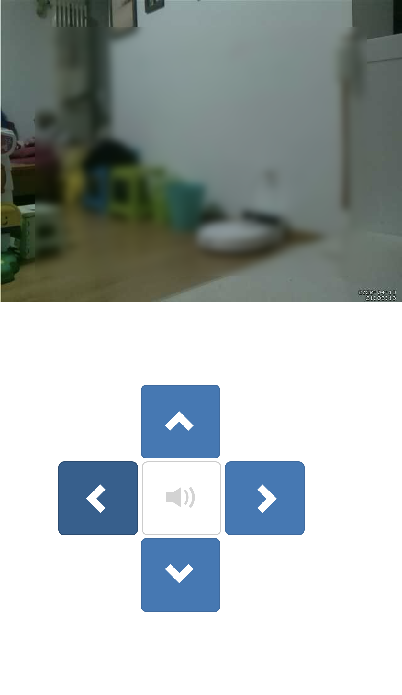

# video monitor
video-monitor let you control the camera from a mobile phone.

**Hardwares:**
- Raspebrry Pi 3B
- Camera, 500w Pixels
- Servo SG90 x2
- Two-Tegree-of-Freedom Pan-Tilt
- Buzzer
- Led

